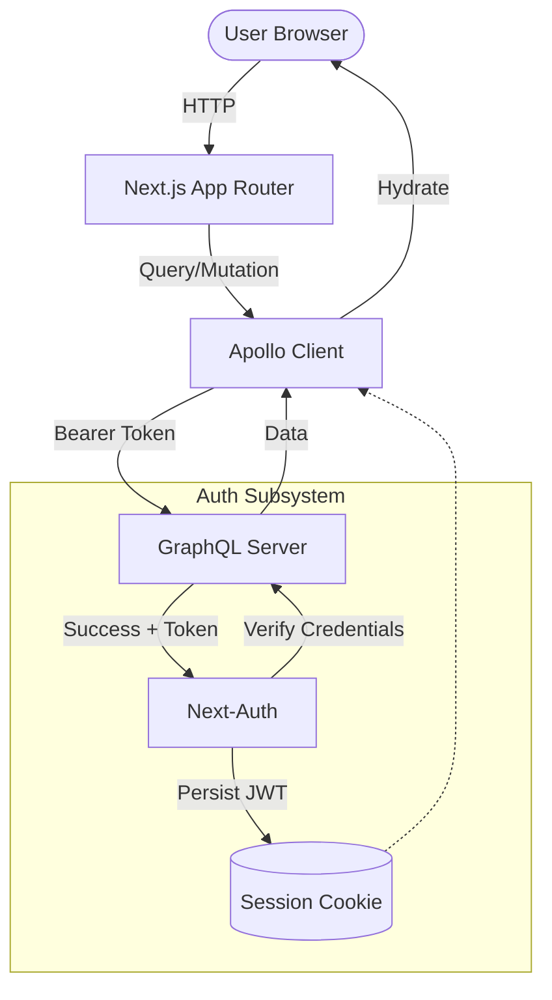

# 🎬 TMDB — Movie & Person Management Portal

[](https://nextjs.org/)
[](https://www.apollographql.com/docs/react/)
[](https://ant.design/)
[](https://tailwindcss.com/)
[](https://next-auth.js.org/)


A high-performance, full-stack movie database application designed for cinema enthusiasts and content managers. This portal provides a seamless **CRUD (Create, Read, Update, Delete)** experience for movies and people, powered by a scalable **GraphQL backend**.

---

## 🚀 Key Features

- **📽️ Movie Management**: Browse a vast catalog of films with detailed profiles, including revenue, budget, and genres.
- **🎭 Person Directory**: Manage a global directory of actors and crew members with biography snapshots and popularity scores.
- **🔍 Advanced Search & Sort**: Real-time debounced searching, infinite scrolling for movies, and paginated lists for persons.
- **🔐 Secure Operations**: Write-protected operations (Create/Edit/Delete) with **Next-Auth** JWT-based session management.
- **🏗️ Modern UI/UX**: Built with **Ant Design** for consistent component design and **Tailwind CSS** for ultra-responsive styling.
- **📡 Hybrid Rendering**: Optimized performance using **SSR (Server-Side Rendering)** for landing pages and **Apollo Client** for dynamic interactions.

---

## 🛠️ Technology Stack

| Layer | Technology | Purpose |
| :--- | :--- | :--- |
| **Framework** | [Next.js 16](https://nextjs.org/) | App Router, SSR, and API routes |
| **Language** | [TypeScript](https://www.typescriptlang.org/) | Total type safety across the stack |
| **Styling** | [Tailwind CSS 4](https://tailwindcss.com/) | Modern utility-first CSS |
| **UI Components** | [Ant Design 6](https://ant.design/) | Production-ready design system |
| **Auth** | [NextAuth.js](https://next-auth.js.org/) | Secure JWT session management |
| **GraphQL Client** | [Apollo Client](https://www.apollographql.com/) | Client-side data fetching and caching |
| **Icons** | [Lucide React](https://lucide.dev/) | Consistent and clean iconography |

---

## 📂 Project Structure

```bash
tmdb/
├── app/
│   ├── (auth)/             # Login pages and auth layout
│   ├── (main)/             # Movie and Person explorers (SSR + Client)
│   ├── actions/            # Server actions for cache revalidation
│   ├── components/         # Shared UI (Cards, Modals, Forms)
│   ├── graphql/            # Named Queries & Mutations
│   ├── gql/                # Auto-generated Types (GraphQL Codegen)
│   ├── lib/                # Auth options and metadata helpers
│   └── ApolloWrapper.tsx   # Apollo Provider with Bearer token injection
├── middleware.ts           # Route protection and login redirection
├── codegen.ts              # GraphQL code generation config
└── next.config.ts          # Image domain white-listing
```

---

## ⚙️ How it Works

The application uses a **Multi-Stage Auth & Data Flow** to ensure high performance and security.

### 🧩 Data Architecture



### 🔐 Authentication Flow

1. **Submission**: User logs in via `LoginForm` using email/password.
2. **Authorization**: `NextAuth` calls the GraphQL backend `LOGIN_MUTATION` server-side.
3. **Token Storage**: On success, the backend returns a JWT which is stored in an encrypted browser cookie.
4. **Header Injection**: For all subsequent mutations (Create/Edit/Delete), the `ApolloWrapper` reads the session token and injects a `Bearer` token into the GraphQL request headers.

---

## 📡 GraphQL API

| Query / Mutation | Purpose | Impact |
| :--- | :--- | :--- |
| `GET_MOVIES` | Fetch movie list | View/Dashboard |
| `GET_MOVIE_BY_ID` | Fetch single movie details | Details Page |
| `CREATE_MOVIE` | Add a new film record | Protected (Auth required) |
| `UPDATE_MOVIE` | Modify movie details | Protected (Auth required) |
| `DELETE_MOVIE` | Remove a film record | Protected (Auth required) |
| `LIST_PERSON` | Get paginated person list | Person Explorer |

---

## 🚦 System Use Cases

> [!TIP]
> **Guest Users** can browse all movie and person details. **Authenticated Users** gain additional write privileges.

| ID | Feature | Actor | Auth Required |
| :--- | :--- | :--- | :---: |
| **UC-1** | Search movies by title | Any | No |
| **UC-2** | View movie financial data | Any | No |
| **UC-3** | Create/Edit/Delete Movies | Authenticated | **Yes** |
| **UC-4** | Add/Manage Person Directory | Authenticated | **Yes** |

---

## 🏁 Quick Start

### 1️⃣ Clone and Install
```bash
git clone <your-repository-url>
cd tmdb
npm install
```

### 2️⃣ Configure Environment
Create a `.env` file in the root directory:
```bash
BACKEND_GRAPHQL_URL="https://tmdb-server-dev.logicwind.co/graphql"
NEXTAUTH_URL="http://localhost:3000"
NEXTAUTH_SECRET="your-super-secret-key"
```

### 3️⃣ Generate Types
```bash
npm run codegen
```

### 4️⃣ Launch
```bash
npm run dev
```

The application will be accessible at `http://localhost:3000`.

---

> [!NOTE]
> This project is optimized for modern browsers. Images are fetched via generic protocol patterns (`https://**`) as configured in `next.config.ts`.
